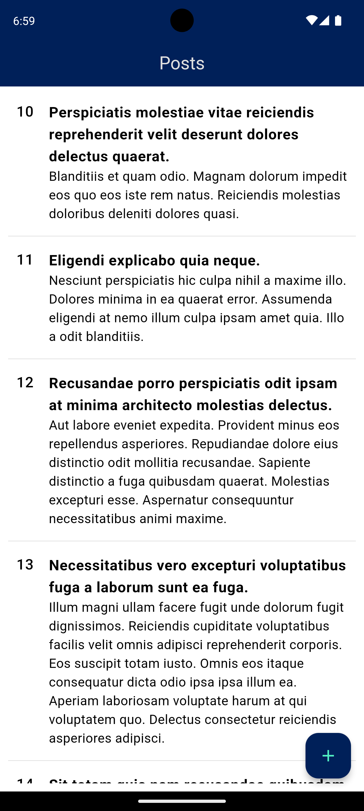

# Posts App

A Flutter application where I applied the clean architecture principles to make my code cleaner and easier to understand and maintain.

The application shows how to handle the flow of data in a Flutter application by using the Single Source of Truth principle, followed by making a local cache for the posts list. The posts data is received from an API created with [mockapi.io](https://mockapi.io).

## Screenshots
<p align="center">
  
  
  
</p>

## Features
* Clean Architecture implementation
* Local caching for posts using Shared Preferences [Note](#note-on-local-caching)
* Data retrieval from a mock API
* Error handling and state management with flutter_bloc
* Dependency injection with get_it

## Dependencies
```yaml
dependencies:
  flutter_bloc: ^8.1.6
  dartz: ^0.10.1
  equatable: ^2.0.5
  get_it: ^7.7.0
  internet_connection_checker: ^1.0.0+1
  http: ^1.2.2
  shared_preferences: ^2.2.3

dev_dependencies:
  flutter_launcher_icons: ^0.13.1
```

## Project Structure
```
lib/
├── core/
│   ├── error/
│   ├── network/
│   └── widgets/
│       └── app_theme.dart
├── features/
│   └── posts/
│       ├── data/
│       │   ├── datasources/
│       │   ├── models/
│       │   └── repositories/
│       ├── domain/
│       │   ├── entities/
│       │   ├── repositories/
│       │   └── usecases/
│       └── presentation/
│           ├── bloc/
│           │   ├── post_details/
│           │   └── posts/
│           ├── screens/
│           └── widgets/
│               ├── post_add_update/
│               ├── post_details/
│               └── posts/
├── injection_container.dart
└── main.dart
```

## Note on Local Caching
In this project, Shared Preferences are used for local caching of the posts list for simplicity. However, it is not recommended for complex data storage due to its limitations. For a more robust solution, consider using a local database like SQLite.
